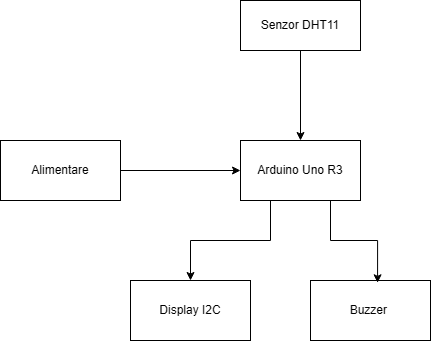
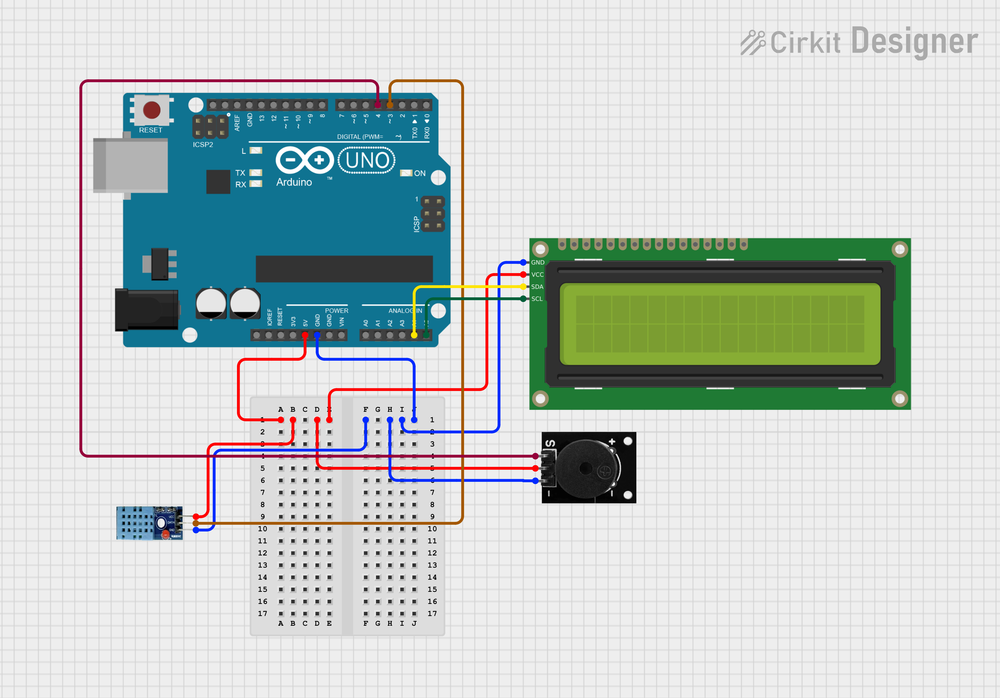

# Stație meteo cu afișaj și alertă sonoră

Vasile Andrei-Alexandru 333CB

# Introducere

Proiectul consta intr-o statie meteo care masoara temperatura si umiditatea mediului inconjurator, afisand valorile pe un display LCD si generand alerte sonore printr-un buzzer in functie de pragurile de temperatura.

Scopul proiectului este de a crea un sistem simplu si eficient de monitorizare ambientala, util in spatii inchise sau exterioare, care poate avertiza utilizatorul atunci cand conditiile depasesc anumite limite, fara a necesita supraveghere permanenta.

Ideea a pornit de la nevoia unui dispozitiv accesibil care sa ofere informatii esentiale despre mediul ambiant si sa semnaleze automat conditii potential nefavorabile.

Consider ca proiectul este valoros din punct de vedere educational, oferind experienta practica in domeniul senzorilor, al microcontrolerelor si al interfatarii hardware-software. De asemenea, poate fi extins si adaptat pentru aplicatii precum monitorizarea serelor, camerelor tehnice sau altor medii sensibile la variatii de temperatura si umiditate.

# Descriere generala
Proiectul este o statie meteo simpla si eficienta, destinata monitorizarii conditiilor de mediu. Sistemul masoara temperatura si umiditatea din aer folosind un senzor DHT11 si afiseaza informatiile pe un ecran LCD controlat prin interfata I2C. In plus, integreaza un buzzer care ofera alerta sonora daca temperatura depaseste un prag prestabilit, permitand utilizatorului sa ia masuri rapide.

Datele sunt colectate si procesate cu ajutorul unei placi Arduino Uno R3, iar toate componentele sunt conectate pe o placa breadboard pentru usurinta in asamblare si testare. Proiectul este potrivit pentru monitorizarea simpla a mediului in spatii inchise si poate fi extins pentru a include mai multe functii sau senzori suplimentari.

# Hardware design

## Schema bloc:

## Lista de piese:
-	Arduino Uno R3	(Placa principala de control)
-	Senzor DHT11	(Senzor temperatura si umiditate)
-	Display LCD 16x2 I2C	(Modul de afisare a valorilor)
- Buzzer	(Emitere alerta sonora)
-	Breadboard	(Platforma pentru conexiuni rapide)
-	Fire jumper 	(Conectare intre componente)

## Schema Electrica:

# Software design

| Biblioteca            | Rol principal                                                  |
| --------------------- | -------------------------------------------------------------- |
| `DHT.h`               | Interfata pentru senzorul de temperatura si umiditate DHT11    |
| `Wire.h`              | Suport pentru comunicatia I2C (folosita de LCD)                |
| `LiquidCrystal_I2C.h` | Control pentru LCD-ul I2C 16x2                                 |
| `Arduino.h`           | Functii de baza pentru programare pe microcontroller (Arduino) |

In acest proiect sunt folosite urmatoarele componente:
Un senzor de temperatura si umiditate DHT11 conectat pe pinul digital 3, folosit pentru a colecta in timp real temperatura si umiditatea din mediul ambiant.
Un LCD 16x2 cu interfata I2C pentru afisarea valorilor masurate, dar si a modului (zi/noapte) si a mesajelor de alerta.
Un buzzer activ conectat pe pinul digital 4, utilizat pentru a reda o melodie de alerta in caz de conditii periculoase (temperatura si umiditate peste prag).
Functionalitate UART implementata manual folosind registrii, pentru trimiterea catre calculator a temperaturii, umiditatii si orei curente simulate.
Timer1 configurat hardware pentru a schimba periodic afisajul de pe ecran fara a bloca loop().

Initializare UART cu registrii
Functia uartInit() configureaza transmisia seriala UART fara a folosi functiile Serial.begin(), folosind in schimb registrii UBRR0H, UBRR0L, UCSR0B si UCSR0C. Se seteaza viteza la 9600 baud si formatul de 8 biti de date.
Transmiterea caracterelor si valorilor prin UART se face cu functiile uartSendChar(), uartSendStr() si uartSendInt().

Timer1 pentru afisaj automat
Timer1 este configurat in mod CTC (Clear Timer on Compare Match), ceea ce inseamna ca se genereaza o intrerupere la atingerea valorii OCR1A. In cadrul acestei intreruperi se schimba starea afisajului: mod zi/noapte (4 secunde), temperatura (3 secunde), umiditate (3 secunde).

Prescaler-ul de 1024 permite obtinerea unor durate mai mari (pana la cateva secunde) fara a depasi capacitatea contorului de 16 biti.

Afisaj pe LCD
LCD-ul este controlat prin I2C. Este folosit pentru a afisa:

Modul curent: zi (DAY) sau noapte (NIGHT), determinat in functie de ora simulata.

Temperatura, afisata in grade Celsius.

Umiditatea, afisata in procente.

Mesaj de alerta cand temperatura > 25.0 si umiditate > 60.0 in timpul zilei.

Starea afisajului este schimbata automat de intreruperea Timer1.

Calculul timpului curent
Timpul curent este simulat plecand de la o ora initiala data in variabilele startHour si startMinute. In fiecare iteratie se calculeaza ora si minutul curent pe baza valorii returnate de millis(). Acest timp este folosit atat pentru afisarea modului zi/noapte, cat si pentru transmiterea orei prin UART.

Detectarea modului zi / noapte
In functie de ora calculata, se activeaza modul noapte daca ora este intre 21:00 si 08:00. In acest mod, alarma sonora nu este activa pentru a nu deranja in timpul noptii.

Redarea alarmei sonore
Daca temperatura si umiditatea depasesc pragurile stabilite si nu este mod noapte, se activeaza o alerta sonora. Alerta este compusa dintr-o succesiune de frecvente (o melodie simpla) redata folosind digitalWrite() si delayMicroseconds(). Buzzer-ul activ nu are nevoie de semnal PWM, ci doar de alternanta HIGH/LOW cu frecventa potrivita.
La fiecare 10 secunde se trimite prin UART o linie CSV in formatul: hh:mm,temperatura,umiditate

DHT 11 Humidity & Temperature Datasheet: https://www.mouser.com/datasheet/2/758/DHT11-Technical-Data-Sheet-Translated-Version-1143054.pdf
Display I2C Datasheet: http://www.handsontec.com/dataspecs/module/I2C_1602_LCD.pdf
